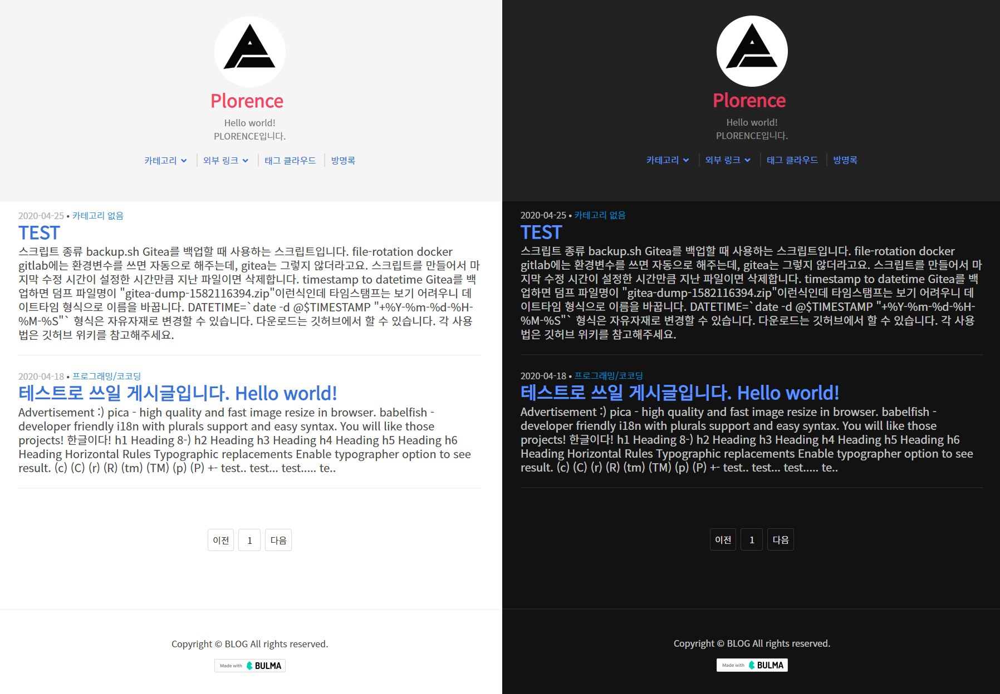

# Plore

  
개발자와 잘 어울리는 티스토리 스킨입니다.  

# 목차
+ [특징](#특징)
    + [지원되는 브라우저](#지원되는-브라우저)
+ [설치](#설치)
    + [설정](#설정)
+ [기여](#기여)
+ [라이센스](라이센스)

# 특징
+ 반응형
+ 오로지 글 내용만  
글 내용 좌우로 아무것도 없으며, 오로지 글 내용에만 집중할 수 있습니다.
+ 글 스타일은 친숙한 Github와 흡사합니다.
+ [Bulma](https://bulma.io/) 사용
+ `BETA` 다크 모드 지원 (스킨 옵션, 브라우저가 지원해야함)
+ jquery를 사용하지 않음
+ 읽는 데 소요 되는 예상 시간 제공
+ 소셜 버튼 지원 (스킨 옵션, Stackoverflow, Github, Reddit 등)
+ 닉네임 옆 무슨 개발자인지 쓸 수 있음(스킨 옵션)
+ 위치 로그 페이지를 사용하지 않음
+ 꾸미기 -> 사이드바를 사용하지 않음
+ 꾸미기 -> 메뉴를 사용하지 않음
## 지원되는 브라우저
|브라우저|최소 버전|
|--------|----------|
|IE| 10(티스토리도 마찬가지로 10까지만 지원) |
|Chrome| 55(여기까지만 확인) |
|Edge| ? |
|Safari | 9 |

# 설치 (**배포 예정 없음**)
1. [Release](https://github.com/zxc010613/plore/releases)에서 가장 최신 버전의 파일을 다운받습니다.
2. 압축을 풉니다.
3. 티스토리 관리 > 꾸미기 > 스킨 편집에 들어갑니다.
4. 스킨 등록 버튼을 클릭합니다.
5. 압축 풀었던 폴더의 파일들을 추가 합니다.
6. 적절한 이름으로 저장합니다.
7. 등록한 스킨에 마우스를 올리고, 적용 버튼을 클릭합니다.

## 설정
+ 콘텐츠 -> 설정 -> 단락 앞뒤에 공백을 `사용하지 않습니다.`
+ 꾸미기 -> 모바일 -> 티스토리 모바일웹 자동 연결을`사용하지 않습니다.`
+ 플러그인 -> 위치로그 표시 `해제`
+ 플러그인 -> 카테고리 글 더 보기 `해제` (적용 비추천, UI 구현 생각 없음.)
+ 플러그인 -> 방문자 통계 그래프 `해제`
+ 플러그인 -> 배너 출력 `해제`
+ 플러그인 -> 태그 입력기 `해제`
+ 플러그인 -> 반응형 웹스킨 이미지 최적화 `적용`

# 기여
PRS 미허용

# 라이센스
[MIT License](./LICENSE)