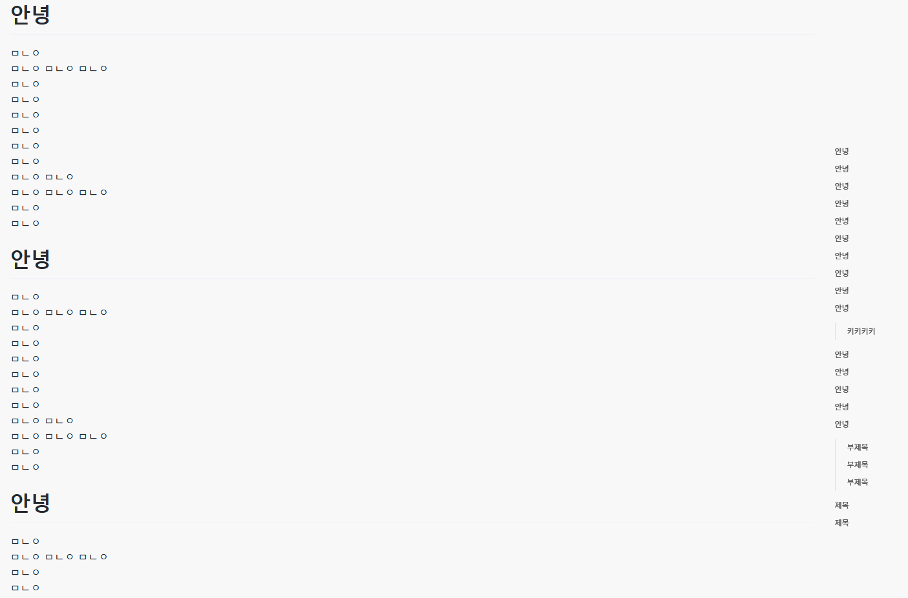

## 0.2.0
- 사이트 타이틀 스타일 변경  
예)`C++ 변수란?::난 바보 개발자` 에서 `C++ 변수란? | 난 바보 개발자`
- Scroll Spy 추가 (옵션 지원)
  

## 0.1.0
- 댓글 간 공백 추가
- 제목 크기 수정
- 웹 표준 최적화(일부)
- 1408px 이상일 때 사이즈 변경
- 글 내에 태그 리스트 아래 공백 수치 수정 `150` > `50`
- 글 아래 공백 삭제
- highlight.js github-gist 테마에서 vs2015 테마로 변경(github-gist테마는 삭제)
- 다크모드 미 사용시 해당 파일은 로드하지 않음
    + images/darkmode.css
    + atom-one-dark.css
- 글 예상 읽기 소요 시간 옵션 지원(스킨 편집에서 가능합니다.)